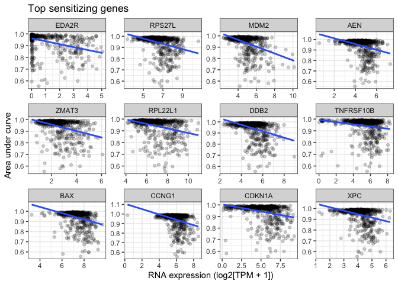
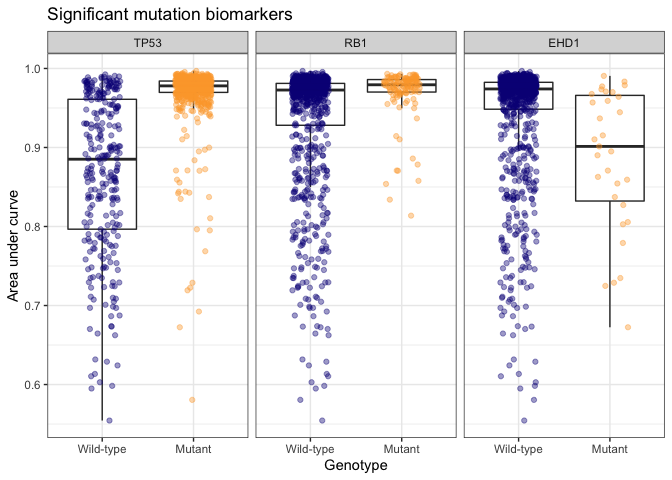

Nutlin-3 example code
================

``` r
library(cellpanelr)
library(tidyverse) # convenient functions for data joining and manipulation
```

    ## ── Attaching packages ─────────────────────────────────────── tidyverse 1.3.1 ──

    ## ✔ ggplot2 3.3.6     ✔ purrr   0.3.4
    ## ✔ tibble  3.1.7     ✔ dplyr   1.0.9
    ## ✔ tidyr   1.2.0     ✔ stringr 1.4.0
    ## ✔ readr   2.1.2     ✔ forcats 0.5.1

    ## ── Conflicts ────────────────────────────────────────── tidyverse_conflicts() ──
    ## ✖ dplyr::filter() masks stats::filter()
    ## ✖ dplyr::lag()    masks stats::lag()

``` r
# Get the nutlin-3 sensitivity data
nutlin <- data_nutlin()

# Take a look at this tibble
glimpse(nutlin)
```

    ## Rows: 968
    ## Columns: 6
    ## $ `Cell line`           <chr> "MOLM-13", "OCI-LY7", "OCI-LY-19", "JVM-3", "SUP…
    ## $ `TCGA classification` <chr> "LAML", "DLBC", "DLBC", "CLL", "ALL", "UNCLASSIF…
    ## $ Tissue                <chr> "blood", "blood", "blood", "blood", "blood", "bl…
    ## $ `Tissue sub-type`     <chr> "acute_myeloid_leukaemia", "B_cell_lymphoma", "B…
    ## $ IC50                  <dbl> 0.419780, 0.557635, 0.627346, 0.606778, 0.598930…
    ## $ AUC                   <dbl> 0.554440, 0.580606, 0.594955, 0.598343, 0.602891…

``` r
# Clean data for next steps
nutlin_clean <-
  nutlin %>%
  # Add DepMap IDs
  add_ids(cell = "Cell line") %>%
  # Remove cell lines that weren't matched to an ID
  filter(!is.na(depmap_id)) %>%
  # Remove cell lines without AUC values
  filter(!is.na(AUC))

glimpse(nutlin_clean)
```

    ## Rows: 937
    ## Columns: 7
    ## $ `Cell line`           <chr> "MOLM-13", "OCI-LY7", "OCI-LY-19", "JVM-3", "SUP…
    ## $ `TCGA classification` <chr> "LAML", "DLBC", "DLBC", "CLL", "ALL", "DLBC", "D…
    ## $ Tissue                <chr> "blood", "blood", "blood", "blood", "blood", "bl…
    ## $ `Tissue sub-type`     <chr> "acute_myeloid_leukaemia", "B_cell_lymphoma", "B…
    ## $ IC50                  <dbl> 0.419780, 0.557635, 0.627346, 0.606778, 0.598930…
    ## $ AUC                   <dbl> 0.554440, 0.580606, 0.594955, 0.598343, 0.602891…
    ## $ depmap_id             <chr> "ACH-000362", "ACH-001617", "ACH-000124", "ACH-0…

``` r
# Correlate gene expression with nutlin-3 AUC
exp_result <- 
  nutlin_clean %>%
  cor_expression(
    response = "AUC",
    ids = "depmap_id"
    )

glimpse(exp_result)
```

    ## Rows: 19,177
    ## Columns: 4
    ## $ gene        <chr> "CDIP1", "GPRIN1", "CUX2", "PLCB2", "SCRT2", "FAM98B", "SM…
    ## $ rho         <dbl> 1.335746e-06, 2.128609e-05, 2.447476e-05, 2.736413e-05, -2…
    ## $ p.value     <dbl> 0.9999723, 0.9995579, 0.9994917, 0.9994317, 0.9994105, 0.9…
    ## $ significant <lgl> FALSE, FALSE, FALSE, FALSE, FALSE, FALSE, FALSE, FALSE, FA…

``` r
# Merge expression correlations with input nutlin-3 data
exp_merged <- 
  nutlin_clean %>%
  inner_join(data_expression(), by = "depmap_id") %>%
  left_join(exp_result, by = "gene")

glimpse(exp_merged)
```

    ## Rows: 13,040,360
    ## Columns: 12
    ## $ `Cell line`           <chr> "MOLM-13", "MOLM-13", "MOLM-13", "MOLM-13", "MOL…
    ## $ `TCGA classification` <chr> "LAML", "LAML", "LAML", "LAML", "LAML", "LAML", …
    ## $ Tissue                <chr> "blood", "blood", "blood", "blood", "blood", "bl…
    ## $ `Tissue sub-type`     <chr> "acute_myeloid_leukaemia", "acute_myeloid_leukae…
    ## $ IC50                  <dbl> 0.41978, 0.41978, 0.41978, 0.41978, 0.41978, 0.4…
    ## $ AUC                   <dbl> 0.55444, 0.55444, 0.55444, 0.55444, 0.55444, 0.5…
    ## $ depmap_id             <chr> "ACH-000362", "ACH-000362", "ACH-000362", "ACH-0…
    ## $ gene                  <chr> "TSPAN6", "TNMD", "DPM1", "SCYL3", "C1orf112", "…
    ## $ rna_expression        <dbl> 0.00000000, 0.00000000, 6.44111824, 1.78659636, …
    ## $ rho                   <dbl> 0.10768266, 0.04440057, 0.13109413, 0.02109921, …
    ## $ p.value               <dbl> 4.938292e-03, 2.475727e-01, 6.102272e-04, 5.8283…
    ## $ significant           <lgl> TRUE, FALSE, TRUE, FALSE, FALSE, FALSE, FALSE, F…

``` r
# Correlate gene expression with nutlin-3 AUC
mut_result <- 
  nutlin_clean %>%
  cor_mutations(
    response = "AUC",
    ids = "depmap_id"
  )

glimpse(mut_result)
```

    ## Rows: 19,537
    ## Columns: 4
    ## $ gene        <chr> "TP53", "RB1", "EHD1", "GIGYF1", "PLXNB1", "RPL22", "MT-CY…
    ## $ effect      <dbl> 0.16208089, 0.05516765, -0.08707963, -0.05296515, -0.03207…
    ## $ p.value     <dbl> 1.231398e-65, 1.294596e-08, 6.428953e-06, 1.268991e-05, 3.…
    ## $ significant <lgl> TRUE, TRUE, TRUE, FALSE, FALSE, FALSE, FALSE, FALSE, FALSE…

``` r
# Merge expression correlations with input nutlin-3 data
mut_merged <- 
  nutlin_clean %>%
  inner_join(data_mutations(), by = "depmap_id") %>%
  left_join(mut_result, by = "gene")

glimpse(mut_merged)
```

    ## Rows: 18,188,947
    ## Columns: 12
    ## $ `Cell line`           <chr> "MOLM-13", "MOLM-13", "MOLM-13", "MOLM-13", "MOL…
    ## $ `TCGA classification` <chr> "LAML", "LAML", "LAML", "LAML", "LAML", "LAML", …
    ## $ Tissue                <chr> "blood", "blood", "blood", "blood", "blood", "bl…
    ## $ `Tissue sub-type`     <chr> "acute_myeloid_leukaemia", "acute_myeloid_leukae…
    ## $ IC50                  <dbl> 0.41978, 0.41978, 0.41978, 0.41978, 0.41978, 0.4…
    ## $ AUC                   <dbl> 0.55444, 0.55444, 0.55444, 0.55444, 0.55444, 0.5…
    ## $ depmap_id             <chr> "ACH-000362", "ACH-000362", "ACH-000362", "ACH-0…
    ## $ gene                  <chr> "VPS13D", "AADACL4", "IFNLR1", "TMEM57", "ZSCAN2…
    ## $ mutant                <lgl> FALSE, FALSE, FALSE, FALSE, FALSE, FALSE, FALSE,…
    ## $ effect                <dbl> 0.0028312198, 0.0158583013, 0.0076457585, -0.022…
    ## $ p.value               <dbl> 0.96460649, 0.97371646, 0.79768325, 0.17184190, …
    ## $ significant           <lgl> FALSE, FALSE, FALSE, FALSE, FALSE, FALSE, FALSE,…

``` r
# Plot top gene expression biomarkers
exp_merged %>%
  # Filter for 12 genes with strongest negative correlation
  filter(dense_rank(rho) <= 12) %>%
  # Convert gene to a factor so that faceted plot is sorted by rho
  mutate(gene = fct_reorder(gene, rho)) %>%
  # Create plot
  ggplot(aes(x = rna_expression, y = AUC)) +
  geom_point(alpha = 0.2) +
  geom_smooth(method = "lm", se = FALSE) +
  xlab("RNA expression (log2[TPM + 1])") +
  ylab("Area under curve") +
  ggtitle("Top sensitizing genes") +
  facet_wrap(~gene, scales = "free") +
  theme_bw()
```

    ## `geom_smooth()` using formula 'y ~ x'

<!-- -->

``` r
# Plot top mutation biomarkers
mut_merged %>%
  # Plot only significant mutations
  filter(significant) %>%
  # Convert gene to a factor so that faceted plot is sorted by p.value
  mutate(gene = fct_reorder(gene, p.value)) %>%
  # Change naming of mutant to be more explicit
  mutate(mutant = ifelse(mutant, "Mutant", "Wild-type")) %>%
  mutate(mutant = factor(mutant, levels = c("Wild-type", "Mutant"))) %>%
  # Create plot
  ggplot(aes(x = mutant, y = AUC)) +
  geom_boxplot(outlier.shape = NA) +
  geom_jitter(aes(color = mutant), width = 0.2, alpha = 0.4) +
  facet_wrap(~gene) +
  scale_color_viridis_d(option = "C", end = 0.8) +
  theme_bw() +
  theme(legend.position = "none") +
  xlab("Genotype") +
  ylab("Area under curve") +
  ggtitle("Significant mutation biomarkers")
```

<!-- -->
